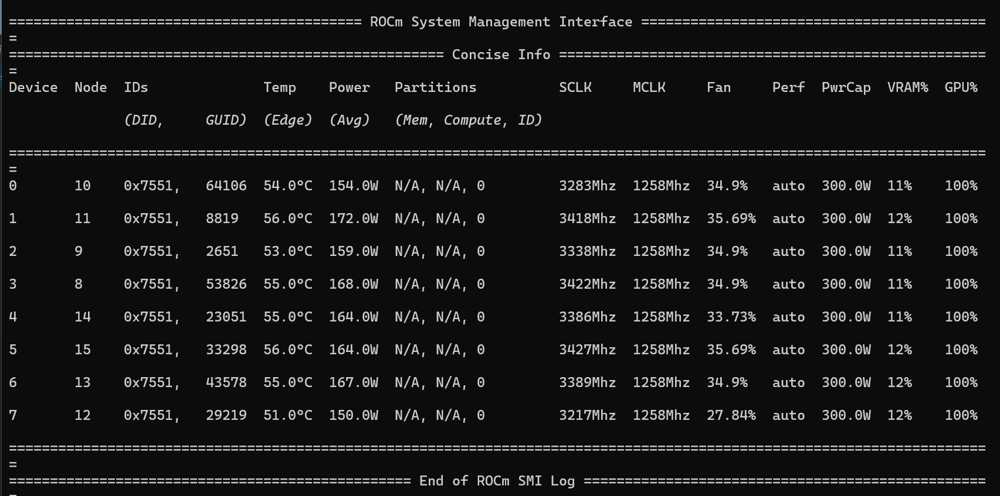

# GSplat-ROCm-RDNA4

## Native 3D Gaussian Splatting Training on AMD RDNA4 (gfx1201)

Run the official [gsplat](https://github.com/nerfstudio-project/gsplat) 3D Gaussian
Splatting trainer **natively on AMD RDNA4 (gfx1201)** GPUs — no CUDA, no ZLUDA,
no translation layers. This repo packages the [ROCm gsplat fork](https://github.com/ROCm/gsplat)
into a reproducible Docker image with the fixes needed to build and run correctly
on wave32 RDNA4 hardware.

Works on **any gfx1201 / RDNA4 Radeon card**, including the **Radeon RX 9070 / RX 9070 XT**
and the **Radeon AI PRO R9700** (the card used for the results below). Any GPU that
reports `gfx1201` should build and run with the same image.

<p align="center">
  
</p>

<p align="center">
  <a href="https://github.com/charyang-ai/gsplat-rocm/blob/main/assets/training.mp4">Watch the full training clip (MP4)</a>
</p>

---

## Why this project

The ROCm gsplat fork was written for **CDNA (gfx942, wave64)** data-center GPUs. On a
consumer/pro **RDNA4 (gfx1201, wave32)** card it fails in three ways that this repo
fixes at build time:

| # | Problem | Fix |
|---|---------|-----|
| 1 | `setup.py` runs `rocminfo` at build time, finds no GPU, and falls back to **gfx942** → the `.so` has no gfx1201 code objects | Honor `PYTORCH_ROCM_ARCH` for `--offload-arch` (`patches/setup.py.gfx1201.patch`) |
| 2 | Bundled **glm** headers fail hipify's rewritten CUDA-version gate; `.hpp` copied but sibling `.inl` missing | Vendored-glm include first + `-DTORCH_HIP_VERSION=8000` + two-pass build with `.inl` top-up |
| 3 | Kernels **hardcode a 64-lane warp** (wave64); on wave32 this hits rocprim's NAVI no-op and silently corrupts the backward color/gradient pass | Compile-time `constexpr int WARP_SIZE` (32 on RDNA, 64 on CDNA) threaded through the reduction/tiling kernels (`patches/wave_size.gfx1201.patch`) |

The result is a byte-correct forward **and** backward pass on gfx1201, validated by a
numerical correctness test against the fork's PyTorch reference.

---

## Features

- HIP-native build of gsplat for **gfx1201 / RDNA4**
- ROCm **7.2.1** + PyTorch **2.9.1** base image
- wave32-correct kernels (guarded `WARP_SIZE` patch)
- `examples/simple_trainer.py` support (full 3DGS training + benchmark)
- **Multi-GPU training** (tested on 8× R9700, NCCL/RCCL backend, no `torchrun` needed)
- [TriSSIM](https://github.com/charyang-ai/TriSSIM) fused-Triton `fused_ssim` drop-in —
  the upstream CUDA extension does not build on ROCm — **12.0× on the loss**
- `triraster/`, an autotuned Triton rasterizer backward, opt-in via `--ras_bwd triton`
- **2.45× on the whole training step** with those plus `--tile-size 16` (see
  [What we measured](#what-we-measured))
- Smoke test, numerical correctness test and a three-level gradient gate baked into the image

---

## Requirements

| | |
|---|---|
| **GPU** | Any AMD RDNA4 / gfx1201 card — e.g. Radeon RX 9070, RX 9070 XT, Radeon AI PRO R9700 |
| **Driver / ROCm** | ROCm 7.2.1-compatible kernel + `amdgpu` driver, `/dev/kfd` + `/dev/dri` accessible |
| **Host** | Linux with Docker (BuildKit) |

---

## 1. Build the image

```bash
docker build -f Dockerfile.gfx1201 -t gsplat-rocm:gfx1201-rocm72 .
```

No GPU is needed to build. Every step is documented inline in
[`Dockerfile.gfx1201`](Dockerfile.gfx1201).

## 2. Run the container

```bash
sudo docker run --rm -it \
  --name gsplat-dev \
  --device=/dev/kfd \
  --device=/dev/dri \
  --group-add video \
  --group-add render \
  --ipc=host \
  --network=host \
  --shm-size=16g \
  -v ~/datasets:/datasets \
  -v ~:/home/$(whoami) \
  -w /opt/gsplat \
  -e HSA_OVERRIDE_GFX_VERSION=12.0.1 \
  gsplat-rocm:gfx1201-rocm72 \
  /bin/bash
```

> `--ipc=host` / `--shm-size=16g` avoid the DataLoader crash caused by Docker's
> default 64 MB `/dev/shm`. `HSA_OVERRIDE_GFX_VERSION=12.0.1` pins the ROCm arch
> string for gfx1201.

## 3. Verify the platform

```bash
cd /opt/gsplat

python - <<'EOF'
import torch
import gsplat

print("torch:", torch.__version__)
print("HIP:", torch.version.hip)
print("CUDA available:", torch.cuda.is_available())
print("GPU:", torch.cuda.get_device_name(0))
print("gsplat:", gsplat.__file__)
EOF
```

Expected output (matches our target setup):

```
torch: 2.9.1+rocm7.2.1.gitff65f5bc
HIP: 7.2.53211-e1a6bc5663
CUDA available: True
GPU: AMD Radeon AI PRO R9700
gsplat: /opt/gsplat/gsplat/__init__.py
```

## 4. (Optional) Run the built-in tests

```bash
# GPU smoke test — forward rasterize on-device
python /opt/gsplat/smoke_test.py rasterize

# Numerical correctness — HIP fwd+bwd vs the torch reference (wave32 merge gate)
python /opt/gsplat/correctness_test.py
```

## 5. Train your 3D Gaussian Splatting model

Download a scene (e.g. the Mip-NeRF 360 `bicycle` scene) into `~/datasets` on the
host so it appears at `/datasets` inside the container, then:

```bash
cd /opt/gsplat

HIP_VISIBLE_DEVICES=0 ROCR_VISIBLE_DEVICES=0 CUDA_VISIBLE_DEVICES=0 python examples/simple_trainer.py default   \
  --data_dir /datasets/bicycle  \
  --data_factor 8   \
  --result_dir ./results/r9700_test  \
  --save_ply
```

> `--save_ply` exports the final Gaussians when training finishes to
> `<result_dir>/ply/point_cloud_<step>.ply` (e.g.
> `./results/r9700_test/ply/point_cloud_29999.ply` with the default 30k steps).

## 6. Multi-GPU (8×) training

The trainer scales to multiple GPUs out of the box — no `torchrun` needed. Internally
`gsplat.distributed.cli` reads `torch.cuda.device_count()` and spawns one process per
visible GPU (NCCL/RCCL backend), so you control the number of GPUs purely through the
`*_VISIBLE_DEVICES` env vars.

Expose all 8 GPUs to the container (note the larger `--shm-size` — the multiprocess
spawn + DataLoader workers need it):

```bash
sudo docker run --rm -it \
  --name gsplat-8gpu \
  --device=/dev/kfd \
  --device=/dev/dri \
  --group-add video --group-add render \
  --ipc=host --network=host \
  --shm-size=64g \
  -v ~/datasets:/datasets \
  -v ~/workspace:/home/$(whoami) \
  -w /opt/gsplat \
  -e HSA_OVERRIDE_GFX_VERSION=12.0.1 \
  gsplat-rocm:gfx1201-rocm72 \
  /bin/bash
```

Confirm all 8 cards are visible, then launch training on 8 GPUs:

```bash
cd /opt/gsplat

# sanity: should print 8
python -c "import torch; print('device_count =', torch.cuda.device_count())"

HIP_VISIBLE_DEVICES=0,1,2,3,4,5,6,7 ROCR_VISIBLE_DEVICES=0,1,2,3,4,5,6,7 CUDA_VISIBLE_DEVICES=0,1,2,3,4,5,6,7 \
python examples/simple_trainer.py default \
  --data_dir /datasets/bicycle \
  --data_factor 8 \
  --result_dir ./results/r9700_8gpu \
  --steps_scaler 0.125 \
  --save_ply \
  --disable-viewer
```

> The effective batch is `batch_size × world_size`, so `--steps_scaler 0.125` keeps the
> total training work comparable to a single-GPU 30k-step run. On exit, ranks are merged
> into `<result_dir>/ply/point_cloud_<max>_distributed_merged.ply`.

Verify all 8 GPUs are actually saturated with `rocm-smi` (`watch -n 1 rocm-smi`) — here
all 8 report **GPU% = 100%** during a training run on the R9700:

<p align="center">
  
</p>

**Tips for 8-GPU runs on ROCm:**
- Multi-GPU comms go through **RCCL**. If init stalls, set `NCCL_DEBUG=INFO`; on
  PCIe-only topologies (no XGMI) try `NCCL_P2P_DISABLE=1`.
- Do **not** use `torchrun` for single-node runs — it conflicts with the internal
  `mp.spawn`. (Multi-node uses the built-in OpenMPI path via `OMPI_COMM_WORLD_*`.)
- A too-small `/dev/shm` crashes the spawned workers — hence `--shm-size=64g` above.

## 7. Profile the training step

`profile_trainer.py` drives the same hot path as the real trainer — gsplat
`rasterization` forward + backward, the L1 + SSIM photometric loss, and an Adam step —
on a randomly generated scene, so it needs **no dataset**. Everything runs under
`torch.profiler` and the operators are printed ranked by GPU time, which is what tells
you where the time actually goes instead of where you assume it goes.

```bash
cd /opt/gsplat

# defaults: 200k Gaussians, 1920x1080, SH degree 0, 30 profiled steps
python profile_trainer.py

# the configuration behind the numbers below
python profile_trainer.py \
  --num-gaussians 500000 --height 1080 --width 1920 \
  --sh-degree 3 --iters 50 --warmup 10
```

### Choosing the SSIM implementation

`--ssim` selects the photometric loss and defaults to `trissim`, the fused Triton loss
the image installs. All options compute the identical 11×11 Gaussian SSIM (σ=1.5,
mean reduction), so only *how* the five blurs are evaluated changes:

| `--ssim` | Implementation |
|----------|----------------|
| `trissim` *(default)* | Installed [TriSSIM](https://github.com/charyang-ai/TriSSIM) fused Triton loss |
| `baseline` | Pure-torch, one 11×11 grouped `conv2d` per blurred quantity (dispatches to MIOpen) |
| `separable` | Pure-torch, the window factored into 11×1 then 1×11 |
| `off` | L1 only — no SSIM term |

Because nothing else in the step changes, running the same command twice with different
`--ssim` values is a controlled before/after experiment: whatever moves in total GPU
time is attributable to the loss.

```bash
python profile_trainer.py --num-gaussians 500000 --sh-degree 3 --iters 50 --ssim baseline
python profile_trainer.py --num-gaussians 500000 --sh-degree 3 --iters 50 --ssim trissim
```

**Check the header line before trusting a run** — it echoes the implementation that was
actually resolved:

```
gaussians=500000  image=1920x1080  sh_degree=3  ssim=trissim (installed fused_ssim)  warmup=10  iters=50
```

If TriSSIM cannot be imported the run **aborts** instead of silently falling back to
L1-only. That matters: a profile that quietly dropped the SSIM term still produces a
believable-looking total, but it is measuring the wrong thing.

### Choosing the rasterizer backward

Once the SSIM loss is fused, the largest single kernel left in a training step is
`rasterize_to_pixels_3dgs_bwd_kernel` at ~24% of GPU time. `--ras_bwd` selects which
implementation computes it; the HIP **forward** rasterizer is used either way.

| `--ras_bwd` | Implementation |
|-------------|----------------|
| `baseline` *(default)* | gsplat's stock HIP `rasterize_to_pixels_3dgs_bwd` kernel |
| `triton` | `triraster/`, an autotuned Triton reimplementation of that one kernel |

The default is `baseline` on purpose — unlike `--ssim`, this path is new, so the
reference numbers never move unless you ask for it. The header line echoes what was
resolved, and `--ras_bwd triton` **aborts** if `triraster` cannot be imported rather
than quietly profiling the HIP kernel under a Triton label.

```bash
python profile_trainer.py --num-gaussians 500000 --sh-degree 3 --iters 50 --ras_bwd baseline
python profile_trainer.py --num-gaussians 500000 --sh-degree 3 --iters 50 --ras_bwd triton
```

In the ranked table the two show up under different names, so a run is never ambiguous:
`rasterize_to_pixels_3dgs_bwd_kernel<3u,...>` for the HIP path,
`_TriRasterizeToPixelsBackward` / `_ras3dgs_bwd_kernel` for the Triton one.

Three copies of `triraster` can coexist — the working tree, an editable install pointing
at it, and the snapshot the image baked in at build time — so the header line prints the
one that actually resolved. Check it before attributing a timing. When iterating on the
kernel from a bind-mounted checkout, make the installed one follow the working tree:

```bash
pip install --no-build-isolation -e /path/to/gsplat-rocm-rdna4/triraster
```

Before trusting any timing, run the gradient gate. It checks at three levels, because
each one is blind to something the next one catches:

```bash
# 1. five cases (cdim 1/3/5, absgrad, backgrounds) as max|diff| / max|ref|
python rasbwd_correctness_test.py

# 2. the same, but against EVERY autotune candidate rather than the one autotune
#    happens to pick here. Autotuning is per shape-specialisation, so a training run
#    at another resolution can land on a config a test never exercised.
python rasbwd_correctness_test.py --verify-configs

# 3. the per-Gaussian gradient NORM, scaled the way DefaultStrategy scales it before
#    thresholding. Densification thresholds each Gaussian separately, so a small
#    systematic bias would shift the final Gaussian count while a single global
#    max|diff| / max|ref| ratio stays clean.
python rasbwd_correctness_test.py --grad-bias

python rasbwd_correctness_test.py --bench          # backward-only A/B timing
python rasbwd_correctness_test.py --tune-report    # time every candidate
```

Measured on the R9700: worst 8.3e-7 over all candidates at both tile sizes, per-Gaussian
relative error ~1e-7 median, and a mean signed bias of ±3e-9 that flips sign between
configs — i.e. within the standard error of zero. **Do not try to establish quality
parity by comparing end-to-end PSNR instead.** Densification amplifies atomic-ordering
perturbations over 30k steps, and swapping this kernel in perturbs ordering exactly as
re-running the HIP kernel does; two *identical* baseline runs on `bicycle` at
`--data_factor 8` differed by 0.14 dB.

### Choosing the tile size

`--tile-size` sets the rasterizer's screen tiling. The ROCm fork defaults to 8, upstream
to 16, and it turns out to be the single largest lever in the step — it drives tile
intersection, the radix sort and the rasterize backward at once:

| | tile 8 | tile 16 | |
|---|---|---|---|
| `intersect_tile_kernel` | 527.4 ms | 79.0 ms | 6.7× |
| rocprim radix sort | 455.8 ms | 140.8 ms | 3.2× |
| `_ras3dgs_bwd_kernel` | 257.2 ms | 328.5 ms | 0.78× |

A 16×16 tile is 4× fewer tiles, so each Gaussian intersects far fewer of them and both
the intersection and sort shrink. The backward moves the other way because it is
register-bound in the number of pixels each program reduces over (see `triraster/`), but
the trade is strongly net positive.

```bash
python profile_trainer.py --num-gaussians 500000 --sh-degree 3 --iters 50 \
  --ras_bwd triton --tile-size 16
```

Note that `examples/simple_trainer.py` has no `--tile_size` flag and never passes one, so
it silently takes the fork's default. `tests/run_simple_trainer.py` wraps it and injects
the value from the environment, which also lets two runs on different GPUs use different
tile sizes without editing a shared `/opt/gsplat`:

```bash
GSPLAT_TILE_SIZE=16 GSPLAT_RAS_BWD=triton \
python tests/run_simple_trainer.py default \
  --data_dir /datasets/bicycle --data_factor 8 --result_dir ./results/tile16 --save_ply
```

### What we measured

500k Gaussians at 1080p, SH degree 3, 50 iterations, on the R9700. Each row adds one
change to the row above it; the column is total self GPU time for the step:

| | Total | rasterize bwd |
|---|---|---|
| stock (torch SSIM, HIP backward, tile 8) | 3.518 s | 597.0 ms |
| + TriSSIM | 2.490 s | 597.0 ms |
| + `--ras_bwd triton` | 2.153 s | 257.2 ms |
| + `--tile-size 16` | **1.436 s** | 328.5 ms |

**2.45× cumulative.** TriSSIM alone is 12.0× on the loss and 1.41× on the step, with
every non-SSIM component invariant to within 2.5% — which is what lets that gain be
attributed to the loss alone. (The 1059.6 → 88.2 ms loss numbers quoted above come from
an earlier series whose stock total was 3.464 s, 1.6% below this one; same 1.39–1.41×.)

The other two are not additive, so the order matters when quoting them. At tile 8 the
Triton backward is worth 2.32× on the kernel and 1.16× on the step; at tile 16 it is
1.49× and 1.10×, because tile 16 has already removed most of the surrounding work. Going
the other way, tile 16 alone is worth 1.56× on the step and 1.50× on top of the Triton
backward.

### Other flags

```bash
python profile_trainer.py --trace trace.json      # also dump a chrome://tracing trace
python profile_trainer.py --row-limit 50          # more rows in the ranked table
python profile_trainer.py --sort-by cuda_time_total
```

For the SSIM kernels in isolation (without the rasterizer around them), use
`ssim_bench_pipeline.py` to time the installed loss, or `ssim_bench_offline.py` to
compare all five variants in one run.

---

## Results

Validation renders on the `bicycle` scene — **left: ground truth, right: gsplat
render on the R9700**.

**Step 7,000** (early convergence)

<p align="center">
  
  
</p>

**Step 30,000** (final)

<p align="center">
  
  
</p>

---

## Repository layout

| Path | Purpose |
|------|---------|
| `Dockerfile.gfx1201` | Reproducible ROCm/gfx1201 build (fully commented) |
| `patches/setup.py.gfx1201.patch` | Arch selection + vendored-glm include + HIP version gate |
| `patches/wave_size.gfx1201.patch` | Guarded `WARP_SIZE` (wave32/wave64) kernel patch |
| [`TriSSIM`](https://github.com/charyang-ai/TriSSIM) | Triton fused-SSIM training loss (installed via `pip install .` in the image) |
| `triraster/` | Autotuned Triton backward for the 3DGS pixel rasterizer (installed in the image, opt-in via `--ras_bwd triton`) |
| `tests/smoke_test.py` | Import + on-GPU rasterize smoke test |
| `tests/correctness_test.py` | HIP fwd+bwd vs torch reference |
| `tests/rasbwd_correctness_test.py` | Triton rasterizer backward vs the HIP kernel — the gate for `--ras_bwd triton` (`--verify-configs`, `--grad-bias`, `--bench`, `--tune-report`) |
| `tests/run_simple_trainer.py` | Runs `examples/simple_trainer.py` with the tile size (and optionally triraster) forced from the environment, since the trainer has no flag for either |
| `tests/ssim_bench_pipeline.py` | In-pipeline SSIM perf test (benchmarks the installed TriSSIM loss; baked into the image) |
| `tests/ssim_bench_offline.py` | Offline, self-contained SSIM benchmark (5 inline variants; no TriSSIM/Docker needed) |
| `tests/profile_trainer.py` | torch.profiler harness: synthetic 3DGS step, kernels ranked by GPU time (`--ssim trissim\|baseline\|separable\|off`, default `trissim`; `--ras_bwd baseline\|triton`, default `baseline`; `--tile-size`, default 8) |
| `assets/` | Training GIF + validation renders |

---

## Acknowledgements

- [nerfstudio-project/gsplat](https://github.com/nerfstudio-project/gsplat) — original CUDA implementation
- [ROCm/gsplat](https://github.com/ROCm/gsplat) — ROCm/HIP fork this image builds from
- AMD ROCm + PyTorch teams for the `rocm/pytorch` base images
