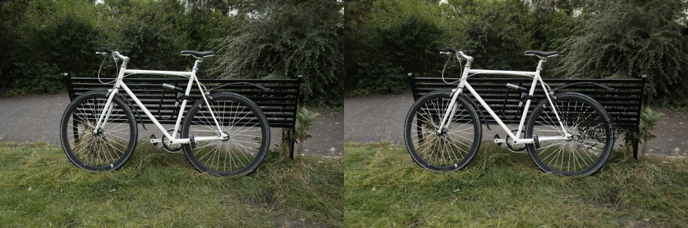
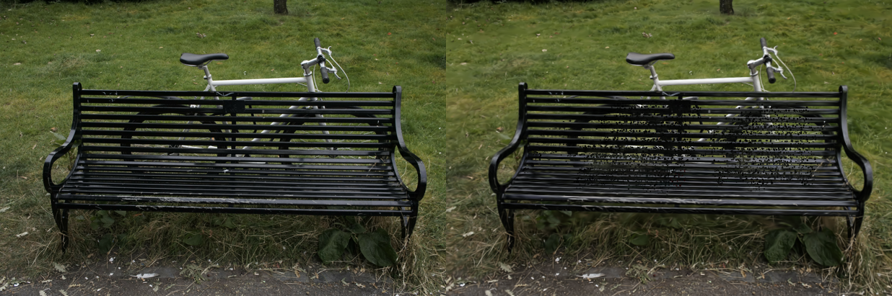
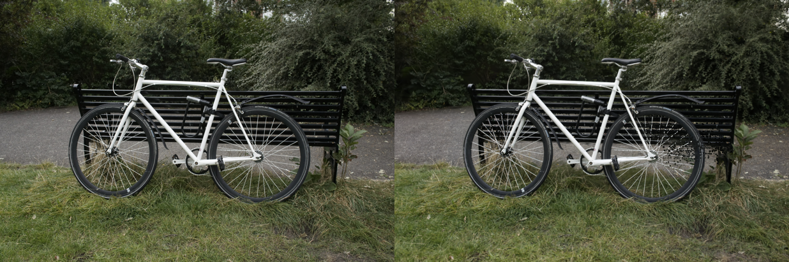
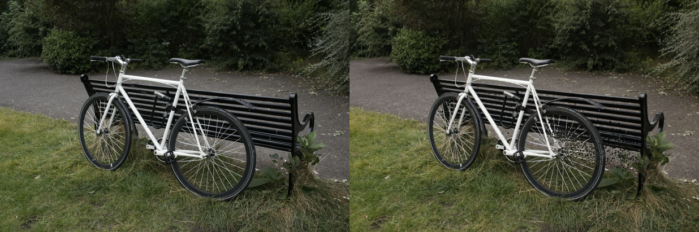

# GSplat-ROCm-RDNA4

## Native 3D Gaussian Splatting Training on AMD Radeon AI PRO R9700

Run the official [gsplat](https://github.com/nerfstudio-project/gsplat) 3D Gaussian
Splatting trainer **natively on AMD RDNA4 (gfx1201)** GPUs — no CUDA, no ZLUDA,
no translation layers. This repo packages the [ROCm gsplat fork](https://github.com/ROCm/gsplat)
into a reproducible Docker image with the fixes needed to build and run correctly
on wave32 RDNA4 hardware.

<p align="center">
  
</p>

---

## Why this project

The ROCm gsplat fork was written for **CDNA (gfx942, wave64)** data-center GPUs. On a
consumer/pro **RDNA4 (gfx1201, wave32)** card it fails in three ways that this repo
fixes at build time:

| # | Problem | Fix |
|---|---------|-----|
| 1 | `setup.py` runs `rocminfo` at build time, finds no GPU, and falls back to **gfx942** → the `.so` has no gfx1201 code objects | Honor `PYTORCH_ROCM_ARCH` for `--offload-arch` (`patches/setup.py.gfx1201.patch`) |
| 2 | Bundled **glm** headers fail hipify's rewritten CUDA-version gate; `.hpp` copied but sibling `.inl` missing | Vendored-glm include first + `-DTORCH_HIP_VERSION=8000` + two-pass build with `.inl` top-up |
| 3 | Kernels **hardcode a 64-lane warp** (wave64); on wave32 this hits rocprim's NAVI no-op and silently corrupts the backward color/gradient pass | Compile-time `constexpr int WARP_SIZE` (32 on RDNA, 64 on CDNA) threaded through the reduction/tiling kernels (`patches/wave_size.gfx1201.patch`) |

The result is a byte-correct forward **and** backward pass on gfx1201, validated by a
numerical correctness test against the fork's PyTorch reference.

---

## Features

- HIP-native build of gsplat for **gfx1201 / RDNA4**
- ROCm **7.2.1** + PyTorch **2.9.1** base image
- wave32-correct kernels (guarded `WARP_SIZE` patch)
- `examples/simple_trainer.py` support (full 3DGS training + benchmark)
- Pure-torch `fused_ssim` drop-in (upstream CUDA extension does not build on ROCm)
- Smoke test + numerical correctness test baked into the image

---

## Requirements

| | |
|---|---|
| **GPU** | AMD RDNA4, gfx1201 (e.g. Radeon AI PRO R9700) |
| **Driver / ROCm** | ROCm 7.2.1-compatible kernel + `amdgpu` driver, `/dev/kfd` + `/dev/dri` accessible |
| **Host** | Linux with Docker (BuildKit) |

---

## 1. Build the image

```bash
docker build -f Dockerfile.gfx1201 -t gsplat-rocm:gfx1201-rocm72 .
```

No GPU is needed to build. Every step is documented inline in
[`Dockerfile.gfx1201`](Dockerfile.gfx1201).

## 2. Run the container

```bash
sudo docker run --rm -it \
  --name gsplat-dev \
  --device=/dev/kfd \
  --device=/dev/dri \
  --group-add video \
  --group-add render \
  --ipc=host \
  --network=host \
  --shm-size=16g \
  -v ~/datasets:/datasets \
  -v ~/workspace:/home/$(whoami) \
  -w /opt/gsplat \
  -e HSA_OVERRIDE_GFX_VERSION=12.0.1 \
  gsplat-rocm:gfx1201-rocm72 \
  /bin/bash
```

> `--ipc=host` / `--shm-size=16g` avoid the DataLoader crash caused by Docker's
> default 64 MB `/dev/shm`. `HSA_OVERRIDE_GFX_VERSION=12.0.1` pins the ROCm arch
> string for gfx1201.

## 3. Verify the platform

```bash
cd /opt/gsplat

python - <<'EOF'
import torch
import gsplat

print("torch:", torch.__version__)
print("HIP:", torch.version.hip)
print("CUDA available:", torch.cuda.is_available())
print("GPU:", torch.cuda.get_device_name(0))
print("gsplat:", gsplat.__file__)
EOF
```

Expected output (matches our target setup):

```
torch: 2.9.1+rocm7.2.1.gitff65f5bc
HIP: 7.2.53211-e1a6bc5663
CUDA available: True
GPU: AMD Radeon AI PRO R9700
gsplat: /opt/gsplat/gsplat/__init__.py
```

## 4. (Optional) Run the built-in tests

```bash
# GPU smoke test — forward rasterize on-device
python /opt/gsplat/smoke_test.py rasterize

# Numerical correctness — HIP fwd+bwd vs the torch reference (wave32 merge gate)
python /opt/gsplat/correctness_test.py
```

## 5. Train your 3D Gaussian Splatting model

Download a scene (e.g. the Mip-NeRF 360 `bicycle` scene) into `~/datasets` on the
host so it appears at `/datasets` inside the container, then:

```bash
cd /opt/gsplat

HIP_VISIBLE_DEVICES=0 ROCR_VISIBLE_DEVICES=0 CUDA_VISIBLE_DEVICES=0 python examples/simple_trainer.py default   \
  --data_dir /datasets/bicycle  \
  --data_factor 8   \
  --result_dir ./results/r9700_test  \
  --save_ply
```

> `--save_ply` exports the final Gaussians when training finishes to
> `<result_dir>/ply/point_cloud_<step>.ply` (e.g.
> `./results/r9700_test/ply/point_cloud_29999.ply` with the default 30k steps).

---

## Results

Validation renders on the `bicycle` scene — **left: ground truth, right: gsplat
render on the R9700**.

**Step 7,000** (early convergence)

<p align="center">
  
  
</p>

**Step 30,000** (final)

<p align="center">
  
  
</p>

---

## Repository layout

| Path | Purpose |
|------|---------|
| `Dockerfile.gfx1201` | Reproducible ROCm/gfx1201 build (fully commented) |
| `patches/setup.py.gfx1201.patch` | Arch selection + vendored-glm include + HIP version gate |
| `patches/wave_size.gfx1201.patch` | Guarded `WARP_SIZE` (wave32/wave64) kernel patch |
| `shims/fused_ssim.py` | Pure-torch SSIM drop-in for the training loss |
| `tests/smoke_test.py` | Import + on-GPU rasterize smoke test |
| `tests/correctness_test.py` | HIP fwd+bwd vs torch reference |
| `assets/` | Training GIF + validation renders |

---

## Acknowledgements

- [nerfstudio-project/gsplat](https://github.com/nerfstudio-project/gsplat) — original CUDA implementation
- [ROCm/gsplat](https://github.com/ROCm/gsplat) — ROCm/HIP fork this image builds from
- AMD ROCm + PyTorch teams for the `rocm/pytorch` base images
